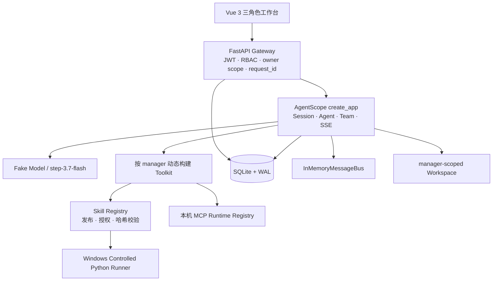

# 架构说明

## 1. 目标与部署形态

RunChain Phase 1 在单个 Windows 主机、单银行实例中运行。`manager0001` 与 `manager0002` 是两个完全隔离的业务边界；`business_admin` 和 `system_admin` 是全局治理角色，不拥有 manager 业务空间，也不能读取会话正文或 Workspace 文件。



Windows 版本不依赖 Docker、Redis、PostgreSQL 或对象存储。进程由 `scripts/start.ps1` 启动，PID 写入 `.run/`，由 `scripts/stop.ps1` 定向停止。

## 2. 请求与身份链路

1. 浏览器通过 `POST /api/auth/login` 提交用户名和密码。
2. Gateway 验证 Argon2 密码哈希并签发 HS256 JWT；JWT 包含用户、角色和固定的 `bank_demo` tenant。
3. 后续业务身份只取自已验证 JWT。客户端提交的 `user_id`、`owner_user_id`、`role` 以及同名 Header/Query 参数不可信。
4. 路由依赖执行角色检查；manager Repository 的每个业务操作都显式接收当前 `owner_user_id`。
5. AgentScope 内部应用挂载于 `/internal/agentscope`，仅允许已认证且启用的 manager 进入；Gateway 将已验证用户身份桥接到 AgentScope 依赖。
6. 每个请求生成 `request_id`，错误响应、SSE 和审计元数据使用它进行关联。

前端路由守卫只改善交互体验，权限判定始终由后端执行。

## 3. Agent 运行链路

普通 Agent 使用 AgentScope `Agent`、模型和 Toolkit。测试环境构造确定性 Fake Model；`APP_ENV=real` 时构造 OpenAI-compatible `step-3.7-flash` 模型。模型密钥只在后端构造模型时解封，不写入数据库或 API 响应。

Toolkit 不是跨用户共享的全局对象。Agent 创建时按当前 manager、agent 和 session 重新查询：

1. 验证用户是启用状态的 manager。
2. 验证 session 同时属于该 manager、匹配 agent 且处于 active 状态。
3. 取已发布 Skill 与当前 manager 授权集合的交集。
4. 对 Skill 版本和磁盘内容做完整性检查。
5. 只加入已启动、已授权 MCP Server 广告的 Tool。
6. 对规范化 Tool 名称执行保留名和碰撞检查。
7. 生成捕获已验证 owner/session 的全新 Tool 实例。

授权变更因此无需重启服务即可在下一次 Agent 构建时生效。

## 4. 接待专家团

接待场景用于展示多 Agent，不代表真实接待业务：

- 接待主管：创建 Team、拆解、汇总并发起 HITL。
- 接站 Agent：优先调用已授权且正在运行的本机 MCP Server；未配置时使用确定性的 MCP 形态 Mock 回退。
- 住宿 Agent：走进程内 Mock Tool。
- 餐饮 Agent：优先调用已发布且已授权的 Python Skill，由 Controlled Runner 真实执行；未配置时使用确定性的 Runner 形态 Mock 回退。

三个 worker 使用 AgentScope `SubAgentTemplate` 注册，并通过 AgentScope Team/Agent 创建工具持久化 Team 结构。三个任务并发执行，节点状态写入 `team_node_runs`；汇总后写入 `hitl_requests` 并暂停。manager 可确认、修改或取消，后端再次校验 HITL、Team run、session 和 owner 后原子恢复。

对浏览器公开的是稳定 SSE 契约：`run_started`、`token`、`agent_started`、`tool_call`、`tool_result`、`agent_completed`、`hitl_pending`、`complete`、`error`。每个事件都包含 request、session、run、timestamp 和 data。AgentScope 内部事件格式变化不会直接泄漏给前端。

## 5. 数据与隔离域

SQLite 开启 foreign keys 和 WAL。业务域表均带 `owner_user_id` 并通过 owner 组合条件访问：

- sessions、messages
- team_runs、team_node_runs、hitl_requests
- workspace_files、skill_invocations

全局治理域包括 users、skills、skill_versions、skill_authorizations、mcp_servers、mcp_tool_authorizations、team_templates 和 audit_logs。管理员读取的是治理元数据和脱敏错误，不复用 manager API 获取业务正文。

Workspace 物理布局包含 manager 身份：

```text
workspace/
  <manager-id>/
    agents/<agent-id>/
    sessions/<session-id>/
    uploads/
    outputs/
```

路径在使用前规范化并验证仍处于当前 manager 根目录内；绝对路径、`..`、reparse point/符号链接逃逸和 owner 不匹配均拒绝。

## 6. Skill、Runner 与 MCP

business_admin 只能从浏览器上传本机 ZIP。Skill 包必须含单一根目录、`SKILL.md` 和 `skill.json`，类型支持 `prompt`、`python`、`mcp`。安装过程限制 ZIP 体积、文件数、解压后大小、路径深度与压缩比，拒绝遍历路径、设备名、重复别名、链接及非法 manifest，并保存内容哈希。

Python Skill 在独立子进程中以结构化 JSON 输入/输出执行，受超时、输出、内存、进程数、并发数和 Windows Job Object 控制。它是可信代码 Runner，不是恶意代码沙箱。

MCP 配置由 business_admin 创建。Phase 1 只接受 allowlist 中的本机 Python Server、规范化 Python 可执行文件和空环境配置；模型密钥不会传给 MCP。Runtime Registry 管理启动、健康、Tool 发现、调用、显式停止和退出清理；应用启动与正常关闭都会把没有对应内存 Runtime 的持久化 `running` 状态收敛为 `stopped`。

接待专家团在每次对话时按当前 manager/session 动态选择上述受控能力：有可用授权时走真实 Skill Runner 和 MCP `CallTool`，否则才使用结构相同的确定性 Mock 回退，确保全新环境也能演示编排。HTTP 对话的 `request_id` 会贯穿专家团 runtime，并写入 Skill 与 MCP 调用审计，便于端到端关联一次演示请求。

## 7. 生命周期与就绪

根应用 lifespan 顺序初始化目录安全检查、数据库 Schema/种子、Skill/Runner/MCP 服务、模型与 AgentScope 子应用。关闭时以不可中断清理保证 MCP Registry 先进入终止态，再关闭 Skill 数据库会话并 dispose SQLAlchemy engine。

`/api/health` 表示进程存活；`/api/ready` 汇总数据库、Workspace、AgentScope 导入、Runner 能力和非敏感模型配置状态。数据库检查验证必需表、Alembic head，并在两秒边界内执行只回滚的 SQLite 写入探针。真实模型的外部连通性是单独状态，不让离线 Fake Model 测试依赖外网。

## 8. Phase 2 替换边界

Phase 2 可保持 Gateway 和业务 API 基本不变，替换以下后端接口：

| Phase 1 | Phase 2 候选 |
|---|---|
| SQLite | PostgreSQL |
| InMemoryMessageBus | Redis MessageBus |
| Windows Controlled Python Runner | Ubuntu Docker Sandbox Executor |
| 本机 Mock/allowlist MCP | 真实业务 MCP 与内部系统 |
| Mock 接待模板 | 按业务配置的专家团 |

真实爬虫、搜索、OCR、Dify、银行内部系统以及尽调/报告业务均属于 Phase 2。
